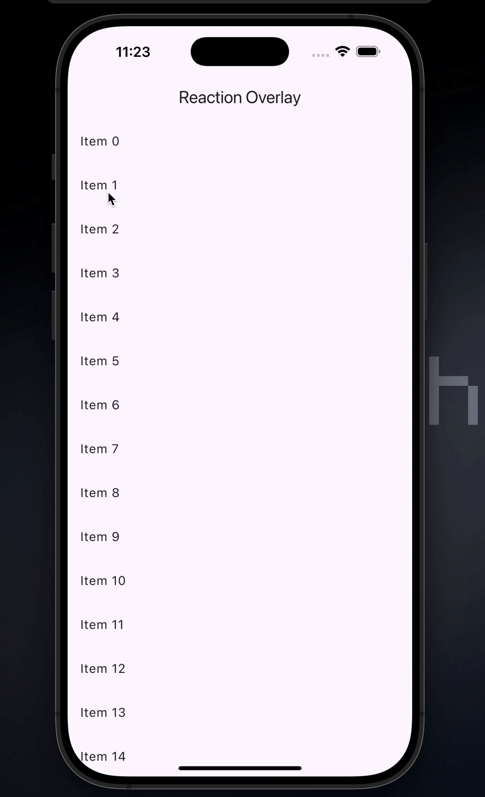

<!--
This README describes the package. If you publish this package to pub.dev,
this README's contents appear on the landing page for your package.

For information about how to write a good package README, see the guide for
[writing package pages](https://dart.dev/tools/pub/writing-package-pages).

For general information about developing packages, see the Dart guide for
[creating packages](https://dart.dev/guides/libraries/create-packages)
and the Flutter guide for
[developing packages and plugins](https://flutter.dev/to/develop-packages).
-->

**Reaction Overlay** is a component that helps open a floating window above the list item. You can add **IconButtons** with different functions.

## Getting started

### Properties in almost every reaction overlay widget:

| Property      | Type         | Description                                                                                       |
| ------------- | ------------ | ------------------------------------------------------------------------------------------------- |
| context       | **BuildContext**          | The `BuildContext` of the current widget tree. Used to obtain the overlay.                                                      |
| itemKey       | **Map<int, GlobalKey>**   | A map of widget IDs to their respective `GlobalKey`. Each `GlobalKey` helps locate the target widget on the screen.                                                          |
| itemId        | **int**                   | The unique identifier of the target widget within `itemKey`. Determines where the overlay should be positioned animation.                                                            |
| curve         | **Curve**                 | (Optional) Defines the animation curve for showing the overlay. Defaults to `Curves.easeOutBack` starts                                                    |
| padding       | **EdgeInsets**            | (Optional) Specifies the padding inside the overlay container. Defaults to `EdgeInsets.all(5)`.                        |
| borderRadius  | **BorderRadius**          | (Optional) Defines the border radius of the overlay. Defaults to `BorderRadius.circular(50)`.                        |

## Usage

```dart
import 'package:flutter/material.dart';
import 'package:reaction_overlay/reaction_overlay.dart';

void main() => runApp(const MyApp());

class MyApp extends StatelessWidget {
  const MyApp({super.key});

  @override
  Widget build(BuildContext context) {
    return MaterialApp(
      title: 'Reaction Overlay',
      debugShowCheckedModeBanner: false,
      home: Scaffold(
        appBar: AppBar(title: const Text('Reaction Overlay')),
        body: const _Items(),
      ),
    );
  }
}

class _Items extends StatelessWidget {
  const _Items();

  @override
  Widget build(BuildContext context) {
    final Map<int, GlobalKey> itemsKeys = {};

    return ListView.builder(
      itemCount: 20,
      itemBuilder: (context, index) {
        itemsKeys[index] = GlobalKey();
        return ListTile(
          key: itemsKeys[index],
          title: Text('Item $index'),
          onTap: () => AppReactionOverlayManager().showReactionOverlay(
            context: context,
            itemKeys: itemsKeys,
            itemId: index,
            buttons: [
              IconButton(
                icon: const Text("👍", style: TextStyle(fontSize: 24)),
                onPressed: () {
                  ScaffoldMessenger.of(context).showSnackBar(
                    const SnackBar(content: Text('You liked this item.')),
                  );
                },
              ),
              IconButton(
                icon: const Text("❤️", style: TextStyle(fontSize: 24)),
                onPressed: () {
                  ScaffoldMessenger.of(context).showSnackBar(
                    const SnackBar(content: Text('You loved this item.')),
                  );
                },
              ),
              IconButton(
                icon: const Text("😂", style: TextStyle(fontSize: 24)),
                onPressed: () {
                  ScaffoldMessenger.of(context).showSnackBar(
                    const SnackBar(content: Text('You laughed at this item.')),
                  );
                },
              ),
              IconButton(
                icon: const Text("😮", style: TextStyle(fontSize: 24)),
                onPressed: () {
                  ScaffoldMessenger.of(context).showSnackBar(
                    const SnackBar(content: Text('You were surprised.')),
                  );
                },
              ),
            ],
          ),
        );
      },
    );
  }
}
```


## Example 02 - Only widget.
```dart
AppReactionOverlayManager().showReactionOverlay(
  context: context,
  itemKeys: itemsKeys,
  itemId: index,
  buttons: [
    // IconButtons
  ],
)
```

## Demo

For complete examples, check the `example` folder inside the repository



## Additional information

Check the [**repository for more examples**](https://github.com/Ignaciomanchu1998/reaction_overlay), or the example folder inside the package.

Don't forget to like the package if you find it useful, and if you have any suggestion, please let me know.
